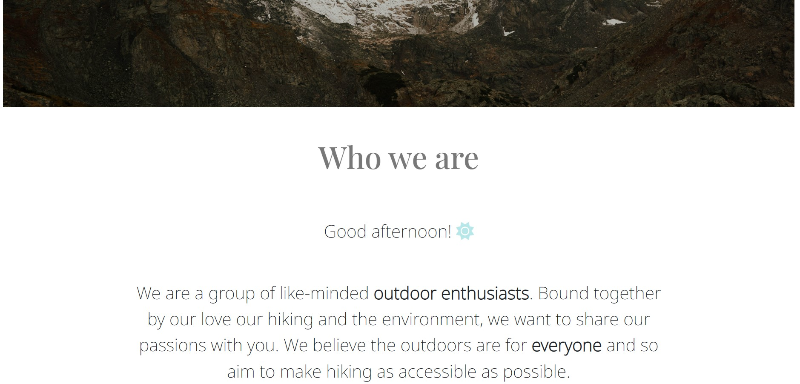

# Trek Ahead.

## Contents
### [UX](https://github.com/anniefenton/milestone-project-2#ux-1)
- [Project goals](https://github.com/anniefenton/milestone-project-2#project-goals)
- [User goals](https://github.com/anniefenton/milestone-project-2#user-goals)
- [User stories](https://github.com/anniefenton/milestone-project-2#user-stories)
### [Site Features](https://github.com/anniefenton/milestone-project-2#site-features-1)
- [Home page](https://github.com/anniefenton/milestone-project-2#home-page)
- [Hikes page](https://github.com/anniefenton/milestone-project-2#hikes-page)
- [Sustainability page](https://github.com/anniefenton/milestone-project-2#sustainability-page)
- [Designed page](https://github.com/anniefenton/milestone-project-2#designed-page)
- [Navigation and Footer bar](https://github.com/anniefenton/milestone-project-2#navigation-and-footer-bar)
### [Design choices](https://github.com/anniefenton/milestone-project-2#design-choices-1)
- [Wireframes](https://github.com/anniefenton/milestone-project-2#wireframes)
- [Images](https://github.com/anniefenton/milestone-project-2#images)
- [Font](https://github.com/anniefenton/milestone-project-2#font)
- [Text](https://github.com/anniefenton/milestone-project-2#text)
- [Colour](https://github.com/anniefenton/milestone-project-2#colour)
- [Columns](https://github.com/anniefenton/milestone-project-2#columns)
### [Testing](https://github.com/anniefenton/milestone-project-2#testing-1)
- [Manual - testing user stories](https://github.com/anniefenton/milestone-project-2#manual---testing-user-stories)
- [Automated - building with tests](https://github.com/anniefenton/milestone-project-2#automated---building-with-tests)
- [Bugs encountered](https://github.com/anniefenton/milestone-project-2#bugs-encountered)
### [Technologies Used](https://github.com/anniefenton/milestone-project-2#technologies-used-1)
- [Languages](https://github.com/anniefenton/milestone-project-2#languages)
- [Programmes, Libraries, and Frameworks](https://github.com/anniefenton/milestone-project-2#programmes-libraries-and-frameworks)
### [Deployment](https://github.com/anniefenton/milestone-project-2#deployment-1)
- [How to run this project locally](https://github.com/anniefenton/milestone-project-2#how-to-run-this-project-locally)
- [Forking the GitHub repository](https://github.com/anniefenton/milestone-project-2#forking-the-github-repository)
- [Cloning a repository](https://github.com/anniefenton/milestone-project-2#cloning-a-repository)
### [Credits](https://github.com/anniefenton/milestone-project-2#credits-1)
- [Media](https://github.com/anniefenton/milestone-project-2#media)
- [Code](https://github.com/anniefenton/milestone-project-2#code)
- [Acknowledgements](https://github.com/anniefenton/milestone-project-2#acknowledgements)

## UX
### **Project Goals**

This site aims to feature the best tried-and-tested hiking routes in the UK, using interactive elements such as Google Maps API, and EmailJS. The site will feature user's reviews of the site whilst raising awareness of the beautiful landscape within the UK. There will also be a contact form in which users can get in contact with the site-owner to enquire about their service of designing bespoke and tailoured walks for users. 

### **User Goals**
_Novice Hiker_

A novice hiker would be new to the world of hiking. They may want to know much about the routes local to them, what difficulty the routes are, and how long the route would take. They may be quite nervous or apprehensive to go on their first hike so they would be looking for reassurance from the site.

_Experienced Hiker_

These hikers will have done a lot of hiking in the past, and would be willing to travel further afield to find new experiences. They may want to share their experiences and reviews with others on the site, as well as gain inspiration for their next hike. They may also want to have a unique hiking experience so would be willing to pay to have a bespoke hike designed to them.

_Traveller_

Travellers may also use this site. They may be doing a road-trip around the UK and want to plan in hikes from all over, or they may be staying in one area so would want to explore their local area. They could either be novice or experienced hikers but would use the site primarily for inspiration and local knowledge.

### **User stories**

As a _novice hiker_ I want:

- To learn about routes in my local area
- To know which routes would be easiest to do and that matches my skill level
- To know how long a route would take to complete
- To learn how to look after my local environment
- To gain inspiration and motivation to start hiking safely

As an _experienced hiker_ I want:

- To learn about hikes further afield
- To know how long routes would take
- To share my hiking experiences with others on the site
- To explore the option of a tailoured hike service

As a _traveller_ I want:

- To see hikes available around the UK
- To see hikes available in one area
- To know how long a hike would take
- To see the difficulty of hikes and match them to my skill level
- To explore the option of a tailoured hike service

## Site Features

### **Home page**

The main purpose of the home page is to quickly inform the user about the organisation and to outline the different features on the site. Upon entering the site the user will see a hero-image with the organisation's name and brand clearly visible. When scrolling down the user will find out who the organisation are and what they do, as pictured below.

User reviews of the site are also featured in a section separated by a secondary hero-image. The reviews currently on the page are made-up and have been used to display what that section could look like.

### **Hikes page**

This is the main feature of the _Trek Ahead_ site. At the top of this page is an interactive map with fixed markers that, when hovered over, produce labels that say the hike's name, loction, difficulty level, and time it would take to complete the route. The map is fully scrollable across all devices however the marker labels cannot be seen when using a tablet or mobile device. To counteract this limitation, on the same page underneath 'Routes' there is a list of the featured hiking routes and their corresponding map marker letter, so users will still be able to see the location of the route on the map. 

In the 'Routes' section the route cards display the name, location, difficulty, and time to complete the routes. The cards also display a short description of the route, a user review, and a link to further information about the route.

Instructions on how to submit a review is also featured on the page as well as the difficulty rating guidelines.

### **Sustainability page**

This page has a similar layout to the home page and it's purpose is to educate the user about how to care for environments when out hiking. A link to the country-side code is alse featured on the page. 

### **Designed page**

The other interactive feature on this site is on the 'Designed' page. Styled in a similar way as the home and sustainability pages, this section informs the user about the bespoke hiking service the organisation offers. Underneath the 'what we offer' section is a contact form that has been linked with EmailJS so it is fully operational. The 'Name' and 'Email' parts have a _required_ attribute so the form will not send unless they are filled out. Checkboxes and radio boxes are used so the user can indicate preferences for their hike, as well as their hiking experience level. Once the form has successfully submitted, an alert box pops up to let the user know the form has been submitted. There is also a reset button that lets the user reset the form to a blank version.

Users wishing to submit a hiking review are also instructed to use this contact form. This is to make sure that all enquries submitted by users are not missed by the organisation.

### **Navigation and footer bar**

The navigation bar features the 4 pages of the site and is fully responsive when used on different sized devices. It is fixed, not sticky, so as to not disrupt the fluidiy when scrolling on the pages. When hovered over with the mouse, the text turns black to indicate to the user that they are hovering over that section. Whichever page the user is on, the navigation bar will feature an underline text-decoration. For example, when the user is on 'Designed' the word 'Designed' is underlined.

The footer bar is similar in it's simplicity. On the left side is the brand's name and logo and if clicked, takes the user to the home page. It also features the same hover feature as in the navigation bar. On the right side are the links to the organisations's social media pages. This is the same across all of the site's pages.

### **Features left to implement**

- Google Maps 'Places API' on the 'Hikes' page so the users can see more information about the route when clicking on the marker. 
- On the 'Hikes' page - a way to link the markers to the route cards so when the marker is clicked/tapped, the user is directed to the corresponding route card.

## Design Choices

The site emulates simplicity, elegance, and beauty, as reflected in nature. Bold images are featured alongside small bodies of text so as not to detract from each other. Icons from Font Awesome are used throughout the site to further emphasise what is being written. The overall experience of the site should be informative, refreshing and inspirational.

### **Wireframes**

#### Mobile

#### Ipad

#### Desktop

### **Images**

When researching other travel sites the developer liked how beautiful landscape shots were heavily featured across all pages. She wanted to emulate this and so bold hero images are featured across all pages, apart from the hikes page. Images are also used to define sections within the longer pages such as the 'Home' and 'Hikes' pages. The images chosen are meant to inspire and motivate users to explore their landscapes and go hiking. 

### **Font**

Two font styles were chosen for this project - 'Playfair Display' for headers, and 'Noto Sans' for text bodies and subtitles. 'Playfair Display' is a serif font and has been used to portray elegance within the site. 'Noto Sans' is a sans-serif font and reflects the simplicity within the site. 

### **Text**

All of the headers on the site have the same styling for consistency. They are fully reponsive size-wise to different screen sizes through the use of media queries.

The text bodies have also been styled in a similar way with consitency in styling and responsiveness. Bold tags have been used to emphasis certain words in paragraphs.

### **Colour**

The font uses a dark grey colour instead of black so as not to make the site feel 'heavy' with the text.

The light blue used across the site was taken from one of the images using a colour picker tool. This colour is used in the icons and footer on all pages apart from the 'Sustainability' page. The colour used on that page is green and again was taken from the image using a colour picker tool. Green was used to reflect the associations of green with environmental issues. This colour is also used in the footer icons of this page for fluidity.

### **Columns**

The developer has used Bootsrap's columns and grids layout options to make the site fully reponsive. Columns and grids are used in all sections of the sites and the site was designed through a mobile-first method.

## Testing

All internal and external navigation links have been tested on the site. The interactive map, form validation, the submit, and reset buttons have also been tested. The responsive design has also been tested using the Chrome Developer Tools. All HTML, CSS, and JS files have been passed through code validators and errors have been fixed.

### **Manual - testing user stories**
**As a _novice hiker_ I want:**

- To learn about routes in my local area

The interactive map feature gives an overview of the location of hikes in certain areas using the scroll and zoom function.

- To know which routes would be easiest to do and that matches my skill level

The difficulty rating section on the 'Hikes' page gives a criteria of how the routes are graded for novice, intermediate, and experience hikers. The map labels and route cards feature these difficulty ratings.

- To know how long a route would take to complete

The map labels and route cards tell the user how long it would take to complete a route.

- To learn how to look after my local environment

The 'Sustainability' page gives a condensed, easy to read, summary of the 'Countryside Code'. Further information on the code is provided through a link at the bottom of the site. 

- To gain inspiration and motivation to start hiking safely

The beautiful landscape images and user reviews will inspire other users to start hiking and explore hiking areas.

**As an _experienced hiker_ I want:**

- To learn about hikes further afield

The interactive map feature gives an overview of the location of hikes in certain areas using the scroll and zoom function.

- To know how long routes would take

The map labels and route cards tell the user how long it would take to complete a route.

- To share my hiking experiences with others on the site

The 'Hikes' page instructs the user of how to share reviews: by using the contact form on the 'Designed' page.

- To explore the option of a tailoured hike service

The 'Designed' page informs the user of the bespoke service the organisation offers. The comprehensive contact form will allow the user to express their preferences using the checkboxes and add any further information in the `<textarea>` section.

**As a _traveller_ I want:**

- To see hikes available around the UK

The interactive map feature gives an overview of hikes around the UK upon first loading the 'Hikes' page.

- To see hikes available in one area

The location of hikes in specific areas using the scroll and zoom function.

- To know how long a hike would take

The map labels and route cards tell the user how long it would take to complete a route.

- To see the difficulty of hikes and match them to my skill level

The difficulty rating section on the 'Hikes' page gives a criteria of how the routes are graded for novice, intermediate, and experience hikers. The map labels and route cards feature these difficulty ratings.

- To explore the option of a tailoured hike service

The 'Designed' page informs the user of the bespoke service the organisation offers. The comprehensive contact form will allow the user to express their preferences using the checkboxes and add any further information in the `<textarea>` section.

### **Automated - building with tests**

Automated testing with Jest was used in the development of the `callAlert()` function. This function calls an alert box when the user successfully submits a contact form on the 'Designed' page. With more time the developer would like to fully test that the alert box is successfully called whenever the form has been filled in and the email sent correctly.

### **Bugs encountered**

A bug was encountered when trying to send the completed contact form to the designatated email using EmailJS. Test emails sent from EmailJS were working fine however this was not the case when using the site's form. Using the Chrome Developer Tools console it was seen that an invalid format of file name was being used and thus the emails weren't sending. After fixing this, the function worked correctly. 

Another interesting bug that was resolved was when developing the `callAlert()` function. Initially, the alert box from the `callAlert()` function was deployed everytime the submit button was pressed, regardless of the form being filled in incorrectly. The issue was that the developer was using an event listener within the submit button. To fix this, the developer called the function in the `<form>` opening tag using the `onsubmit=""` attribute instead. This is now successful so the alert box is only submitted once the form has been filled in correctly.

## Technologies Used

### **Languages**
- HTML5
- CSS3
- JavaScript

### **Programmes, Libraries and Frameworks**

- **Balsamiq** to create wireframes for design concepts
- **Bootstrap 5.0** for columns and grids layouts, and route cards on the 'Hikes' page. Also for the form on the 'Designed' page.
- **Email JS** to link the contact form with an email account to collect form responses
- **Font Awesome** for icons on pages and in the footer
- **Git** for verson control
- **GitHub** to store the project after publication from GitPod
- **GitPod** to build the site
- **Google Fonts** for the typography on the whole site
- **Google Maps API** to create the interactive map with markers on the 'Hikes' page
- **Jest** for automated testing procedures
- **Unsplash** for open-source images used in the site

## Deployment
### **How to run this project locally**

1. Log into GitHub and locate the 'milestone-project-2' repository on the 'anniefenton' account.
2. Click on the 'Settings' icon at the top of the repository page.
3. Scroll down the panel on the left-side of the page and click on the 'Pages' section.
4. Under the 'Source' section, click on the 'None' dropdown button and select 'main'. Then click '/root' in the next drop-down button. Then click 'Save'.
5. Wait about 10 minutes for the site to be built before clicking on the [link](https://anniefenton.github.io/milestone-project-2) above in the blue box.

### **Forking the GitHub repository**

1. Log into GitHub and find the 'milestone-project-2' repository on the 'anniefenton' account.
2. At the top of the repository page, click on the 'fork' button. This will create a copy of the repository in your GitHub account. For more information follow this [link](https://docs.github.com/en/get-started/quickstart/fork-a-repo#forking-a-repository).

### **Cloning a repository**
1. Log into GitHub and find the 'milestone-project-2' repository on the 'anniefenton' account.
2. At the top of the repository page, click on the 'Code' drop down button and copy the HTTPS URL that is displayed.
3. Open Git Bash.
4. Change the current working directory to the location where you want the cloned directory.
5. Type 'git clone' and paste the URL you copied in step 2.
6. Press enter. Your clone has been created. For more inforation, follow this [link](https://docs.github.com/en/get-started/quickstart/fork-a-repo#cloning-your-forked-repository).

## Credits

### **Media**

The developer would like to thank John Towner, Jeremy Bishop, Ales Krivec, Tyler Lastovich, Andrea Molina and Ryan Schroeder for their images used on the site which were accessed from Unsplash.

### **Code**

All code, except where credited to other developers, libraries, or frameworks, has been writted by the developer. Credits and URLs have been provided as comments in the HTML, CSS, and JS files.

### **Acknowledgements**

The developer would like to thank the Code Institute's tutor support team for their help and support, and her mentor for feedback and guidance.
